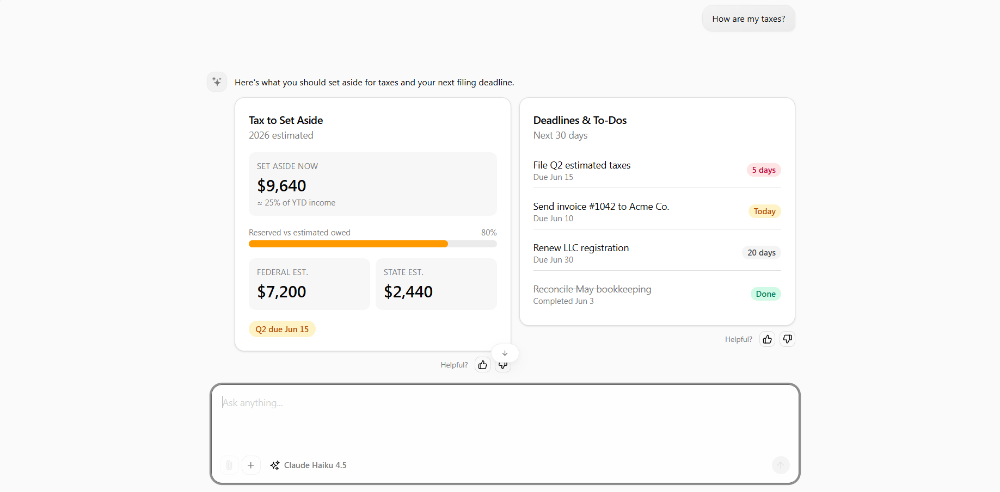
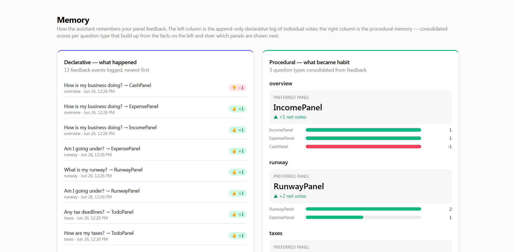
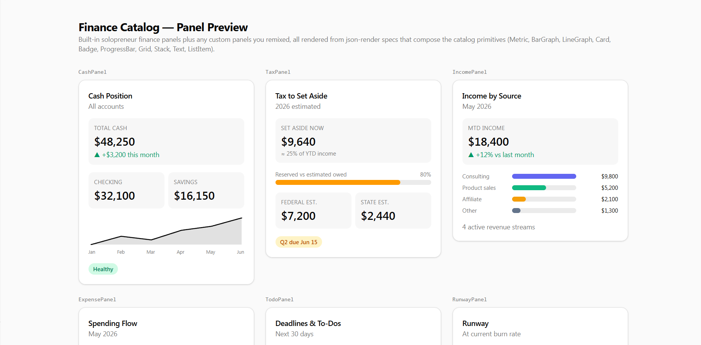

# autoui-solopreneur

> **A solopreneur finance dashboard whose GenUI learns from your feedback and grows its own catalog — a self-improvement stack + continual learning demo.**

Instead of answering money questions with walls of text, the assistant **assembles interactive UI** on the fly, **remembers which views you found useful**, and lets you **combine views into new ones it can then reuse**. The UI is generated, the preferences are learned, and the component catalog is open-ended.

---

## The core idea

```
You ask a finance question
        │
        ▼
Claude assembles json-render PANELS (not prose)  ──►  rendered live in the chat
        │
        ▼
You 👍 / 👎 each panel
        │
        ▼
Two-part memory is written:
  • declarative — the individual facts ("what happened")
  • procedural  — consolidated habit scores ("what became skill")
        │
        ▼
Future questions PREFER higher-scored panels  ──►  the system improves with use
        │
        ▼
You can COMBINE panels into a new custom panel
        │
        ▼
The new panel joins the catalog — Claude can pick it for later questions
```

In plain terms:

1. **Ask** a finance question in the chat (e.g. *"How are my taxes?"*, *"Am I going under?"*).
2. **Claude responds with panels, not text.** It calls a `showFinancePanels` tool that returns *structured JSON* naming which panels to show; those names resolve to [json-render](https://www.npmjs.com/package/@json-render/react) specs and render inline in the conversation. Different questions yield different panel combinations.
3. **You rate each panel** with thumb up / thumb down.
4. **Feedback becomes memory** in a way modeled on human memory:
   - **Declarative** — an append-only log of individual votes (`{ question, questionType, panel, vote, timestamp }`) — *what happened*, never edited.
   - **Procedural** — derived per-question-type scores (`{ questionType: { panel: score } }`) — *the consolidated skill*, recomputed from the declarative log on every vote.
5. **The system gets better.** Procedural scores are injected into the panel-selection prompt, so the assistant prefers panels you've found useful for similar questions.
6. **You grow the catalog.** A "+" button lets you select one or more existing panels and describe how to combine them; Claude generates a **new** panel spec from the existing primitives, saves it, and it becomes available to the chat tool and the catalog page.

This is a small, concrete demonstration of two ideas at once: a **self-improvement loop** (feedback → memory → better choices) and **continual learning of the UI surface itself** (the catalog grows from use).

---

## Architecture

The system is built around a **renderer-agnostic JSON UI spec**. A panel is just data — a flat tree of element keys, component types, and props — with no framework baked in.

| Layer | What it is | Where |
| --- | --- | --- |
| **Catalog** | Primitive component definitions + their prop schemas (Card, Stack, Grid, Metric, Badge, Text, BarGraph, LineGraph, ProgressBar, ListItem). The vocabulary. | `lib/catalog/finance-catalog.ts` |
| **Specs** | The 6 built-in panels as json-render specs (data only) that compose the primitives. | `lib/catalog/panels.ts` |
| **Registry** | React implementations of each primitive (Tailwind, theme-aware). The renderer. | `lib/catalog/finance-registry.tsx` |
| **Memory** | Two-part learned preferences (declarative facts + procedural scores). | `memory.json` (runtime data) |
| **Custom panels** | User-created panels from remixing existing ones. | `custom-panels.json` (runtime data) |

```
 catalog (vocabulary)  ─┐
                        ├─►  json-render SPEC (pure JSON)  ─►  registry (React)  ─►  rendered UI
 panels + custom-panels ┘                       │
                                                └─►  could also render on other platforms
                                                     (e.g. a Flutter registry) — the spec
                                                     carries no framework assumptions
```

**Why renderer-agnostic matters:** because a panel is just a JSON spec interpreted by a registry, the *same* spec could be rendered by a different registry on a different platform — a native Flutter renderer, an email/HTML renderer, etc. — without changing the catalog, the memory, or the model prompts. Today there's a React registry; tomorrow there could be others.

`memory.json` and `custom-panels.json` are **runtime data files, not source code** — the assistant writes to them through API routes, the same way it would write to a database.

### How a turn flows

- **Chat → panels:** `app/(chat)/api/chat/route.ts` runs the model with the `showFinancePanels` tool (`lib/ai/tools/show-finance-panels.ts`). The tool's `execute` resolves the chosen names (built-in or custom) to specs; `components/chat/finance-panels.tsx` renders them with the registry and shows the 👍/👎 controls.
- **Feedback → memory:** `app/(chat)/api/finance-feedback/route.ts` appends a declarative fact and recomputes procedural scores (`lib/memory/finance-memory.ts`).
- **Remix → catalog:** `app/(chat)/api/custom-panels/route.ts` asks Claude to combine selected specs into a new one (validated to use only existing primitives) and saves it (`lib/catalog/custom-panels.ts`).

---

## Key routes

| Route | What you see |
| --- | --- |
| **`/`** | The chat. Ask finance questions; Claude answers with panels you can rate. The "+" button in the composer opens the panel remixer. |
| **`/catalog-test`** | A gallery of every available panel (6 built-ins + your custom ones), rendered from their specs. |
| **`/memory`** | The two-part memory, visualized: a declarative timeline of votes on the left, consolidated procedural scores on the right — so you can see facts build into habits. |

A persistent left sidebar links **Chat**, **Catalog**, and **Memory**.

---

## Setup

Requirements: Node.js 18+ and [pnpm](https://pnpm.io/).

```bash
# 1. Install dependencies
pnpm install

# 2. Add your Anthropic API key
#    Create .env.local in the project root:
echo "ANTHROPIC_API_KEY=sk-ant-..." > .env.local

# 3. Run the dev server
pnpm dev
```

Open **http://localhost:3000**.

This project talks to **Anthropic Claude directly** via [`@ai-sdk/anthropic`](https://www.npmjs.com/package/@ai-sdk/anthropic) (no AI Gateway). The chat works **without a database** — chat-history persistence is disabled when no `POSTGRES_URL` is set; the only storage used by the learning features is the `memory.json` and `custom-panels.json` files.

| Env var | Required | Purpose |
| --- | --- | --- |
| `ANTHROPIC_API_KEY` | Yes | Calls to Claude for chat, panel selection, and panel remixing. |
| `AUTH_SECRET` | Optional | Signs the local guest session (a dev value is fine). |
| `POSTGRES_URL` | Optional | If set, re-enables chat-history persistence. Not needed for the demo. |

---

## Demo

A full walkthrough: ask **"How are my taxes?"** → panels render → thumb up → ask **"Am I going under?"** → different panels → combine two panels into a new custom one → open **/memory** to see the learned declarative + procedural memory.

<video src="https://github.com/eldengu/autoui-solopreneur/raw/main/docs/demo.mp4" controls muted width="100%"></video>

[](https://github.com/eldengu/autoui-solopreneur/raw/main/docs/demo.mp4)

> If the player above doesn't load inline, click the image to play or download the video (`docs/demo.mp4`).

## Screenshots

**Chat with generated panels**


**Memory page (declarative → procedural)**



**Catalog (built-in + custom panels)**



---

## Tech stack

- **Next.js** (App Router) + React + TypeScript
- **Anthropic Claude** via the **AI SDK** (`ai` + `@ai-sdk/anthropic`)
- **json-render** (`@json-render/core`, `@json-render/react`) for renderer-agnostic UI specs
- **Tailwind CSS** for styling
- File-based runtime memory (`memory.json`, `custom-panels.json`)

---

## Status

A demo / proof-of-concept exploring generative UI, feedback-driven self-improvement, and a growable component catalog. Built on the Vercel AI Chatbot template.
